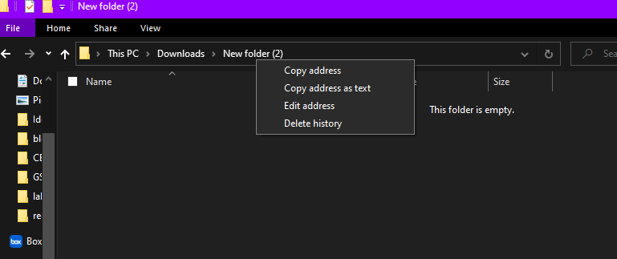

# 1921-disassemble

This is an ARMv4 machine code disassembler for CE1921 Computer Architecture. The user inputs an 8 character hexadecimal number (32 bit instruction) and the program will output the corresponding ARM instruction. This program does not support bad input and the entered string must be a valid known machine code string.

<hr>

### Supported Commands
##### Data
- ADD
- AND
- BIC
- CMN
- CMP
- EOR
- MOV
- MVN
- ORR
- SUB
All shifts are treated as an identity MOV instruction with the corresponding shift. 
##### Load-Store
- LDR
- STR

#### Branch
- BAL
- BL
- BEQ
- BNE

### Instructions
You can clone the project and run the .exe through the command line. If you don't know how to do that, instructions are as follows

- Create a new folder for the repository
- Navigate to the folder and right click it in the top bar. 
- Click copy address



- Open command prompt by typing "cmd" in the windows search bar. 
- type cd address where address is replaced by the address copied to the clipboard
```
cd {address} 
```
- clone the repository by typing git clone https://github.com/xiugaze/1921-disassemble.git 
```
git clone https://github.com/xiugaze/1921-disassemble.git
```
- type ./asm.exe to run the executable